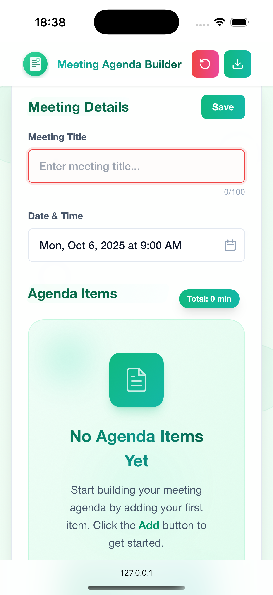
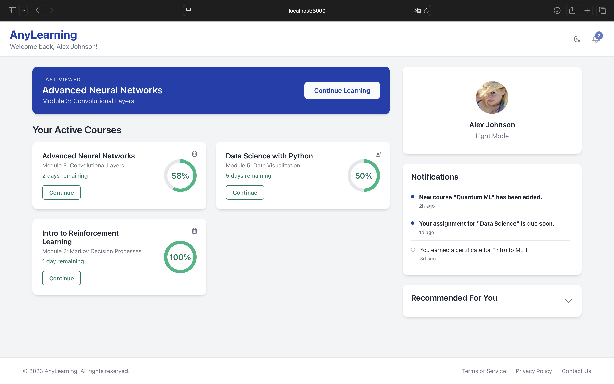

# 🎨 Design and Creation of UI/UX Web Interfaces

This project focuses on **building responsive and interactive web interfaces** with a strong emphasis on **UI/UX design**. It combines modern frontend technologies like **React**, **TypeScript**, **HTML**, **CSS**, and **Tailwind CSS** to create visually appealing and user-friendly applications.

---

## 🚀 Featured Applications

- **Agenda** – Personal planner app for scheduling tasks and events.  
- **Field Simulator** – Interactive tool to simulate real-world scenarios with dynamic inputs and visual feedback.  
- **News Dashboard** – Web dashboard displaying live news feeds with filtering and category selection.  
- **Collage Editor** – Create and customize image collages with drag-and-drop functionality.  
- **Mini-Game** – Interactive browser-based game demonstrating dynamic UI and animations.  
- **Agenda** – Personal planner app for scheduling tasks and events.  
- **Meditation Player** – Web app for guided meditation with smooth audio playback controls.  
- **Student Dashboard** – Dashboard for students with responsive layout and interactive components.

---

## 🖼️ Preview Applications

- **Agenda**  
  

- **Student Dashboard**
  

- **News Dashboard**
  

---

## 🛠️ Tech Stack

| Technology       | Purpose                                      |
|-----------------|----------------------------------------------|
| **React**        | Component-based UI development              |
| **TypeScript**   | Type-safe JavaScript for reliable code      |
| **HTML & CSS**   | Structure and styling                        |
| **Tailwind CSS** | Utility-first CSS for rapid UI development  |

---

## 📱 Features

- Fully **responsive interfaces** for desktop and mobile devices  
- **Interactive components**: drag-and-drop, modals, sliders, and buttons  
- **Consistent UI/UX design** across all applications  
- **Clean, maintainable, and scalable code** using modern frontend best practices

---

## 💻 Getting Started

### Prerequisites

- Node.js 14+  
- npm or yarn
